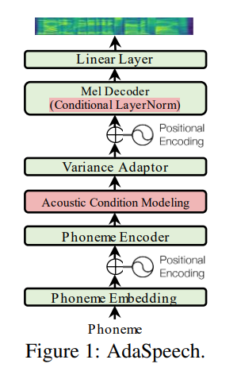
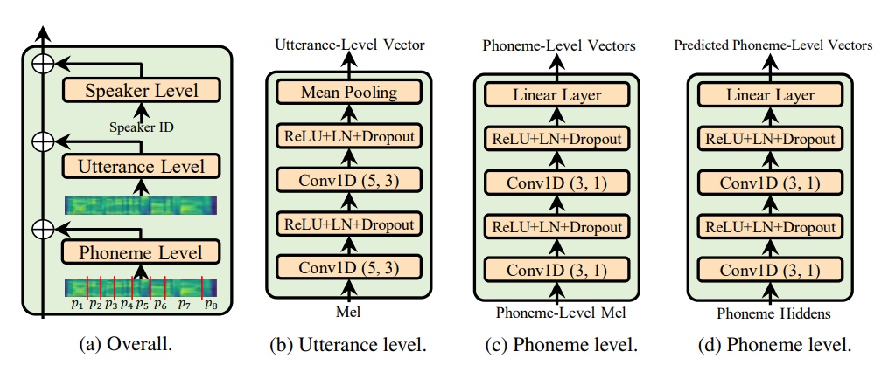

# AdaSpeech: Adaptive Text to Speech for Custom Voice [WIP]
Unofficial Pytorch implementation of [AdaSpeech](https://arxiv.org/pdf/2103.00993.pdf).




## Note:
* I am not considering multi-speaker use case, Iam much more focus only on single speaker.
* I will use only `Utterance level encoder` and `Phoneme level encoder` not condition layer norm (which is the soul of AdaSpeech paper), it definelty restrict the adaptive nature of AdaSpeech but my focus is to improve FastSpeech 2 acoustic generalization rather than adaptation.



## Citations
```bibtex
@misc{chen2021adaspeech,
      title={AdaSpeech: Adaptive Text to Speech for Custom Voice}, 
      author={Mingjian Chen and Xu Tan and Bohan Li and Yanqing Liu and Tao Qin and Sheng Zhao and Tie-Yan Liu},
      year={2021},
      eprint={2103.00993},
      archivePrefix={arXiv},
      primaryClass={eess.AS}
}
```

## Requirements :
All code written in `Python 3.6.2` .
* Install Pytorch
> Before installing pytorch please check your Cuda version by running following command : 
`nvcc --version`
```
pip install torch torchvision
```
In this repo I have used Pytorch 1.6.0 for `torch.bucketize` feature which is not present in previous versions of PyTorch.


* Installing other requirements :
```
pip install -r requirements.txt
```

* To use Tensorboard install `tensorboard version 1.14.0` seperatly with supported `tensorflow (1.14.0)`


## For Preprocessing :

`filelists` folder contains MFA (Motreal Force aligner) processed LJSpeech dataset files so you don't need to align text with audio (for extract duration) for LJSpeech dataset.
For other dataset follow instruction [here](https://github.com/ivanvovk/DurIAN#6-how-to-align-your-own-data). For other pre-processing run following command :
```
python nvidia_preprocessing.py -d path_of_wavs
```
For finding the min and max of F0 and Energy
```buildoutcfg
python compute_statistics.py
```
Update the following in `hparams.py` by min and max of F0 and Energy
```
p_min = Min F0/pitch
p_max = Max F0
e_min = Min energy
e_max = Max energy
```

## For training
```
 python train_fastspeech.py --outdir etc -c configs/default.yaml -n "name"
```

